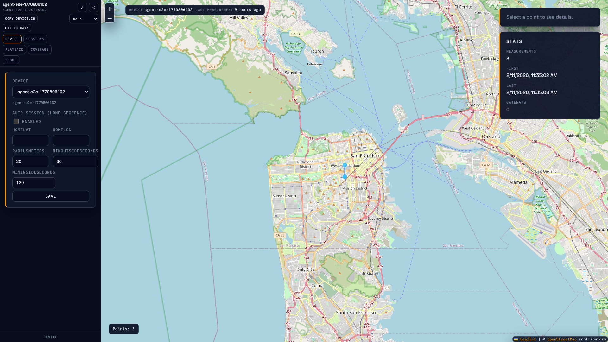
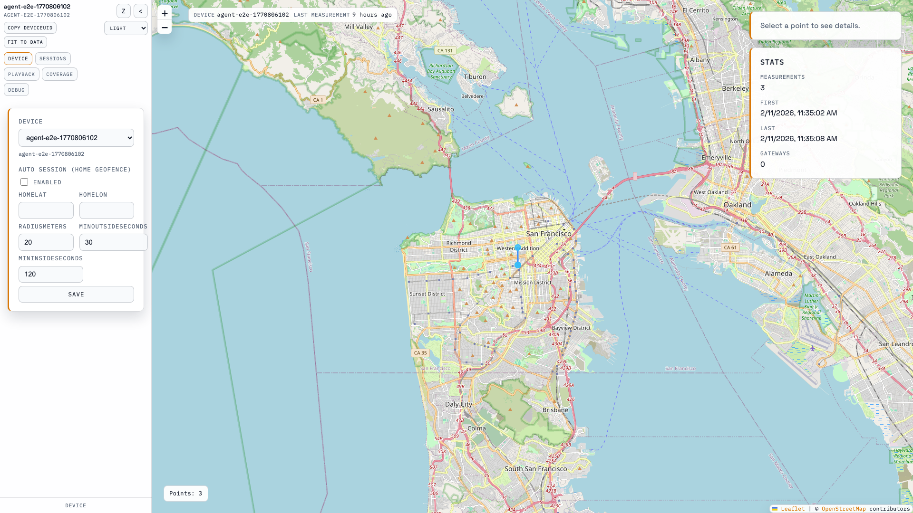

# UI v0.9.3 Theme Checklist

This checklist validates the `System / Light / Dark` theme behavior and visual consistency for the frontend map UI.

## Theme Switching Checklist

- [ ] Theme switcher is visible in expanded sidebar header controls.
- [ ] Theme switcher updates UI immediately (no refresh required).
- [ ] Selected theme mode persists after page reload.
- [ ] In collapsed sidebar mode, the theme control does not clip or overlap controls.
- [ ] In Zen mode, theme control remains available via status strip.
- [ ] Sidebar panels, controls, status strip, and map overlays use theme tokens (no hardcoded inline colors).
- [ ] Leaflet controls remain readable in both themes:
  - [ ] zoom controls
  - [ ] attribution
  - [ ] popups/tooltips

## System Mode Behavior

- `themeMode=system` follows OS/browser `prefers-color-scheme`.
- If system preference changes while app is open, effective theme updates live.
- `themeMode` remains persisted in localStorage as `system`, while rendered theme follows current system preference.

## Screenshots

### Dark Theme

### Light Theme

