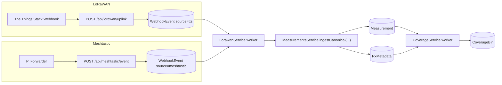
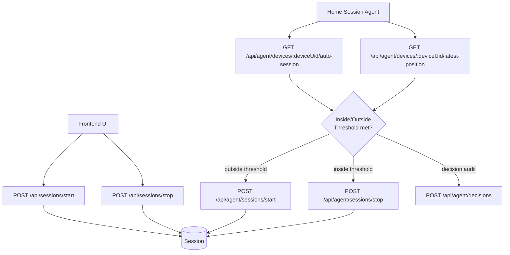

# Architecture

## Components

- Frontend (`frontend/`): React + Vite UI (map, sessions, playback, coverage, debug panels).
- Backend API (`src/modules/*`): NestJS HTTP API for ingestion, querying, sessions, devices, and exports.
- PostgreSQL: primary datastore for `Device`, `Session`, `Measurement`, `RxMetadata`, `WebhookEvent`, `CoverageBin`, and related models.
- Webhook worker (`LorawanService`): background processor for queued `WebhookEvent` rows (`source` in `tts|meshtastic`) into canonical measurements.
- Coverage worker (`CoverageService`): background aggregation of measurements into `CoverageBin`.
- Pi Forwarder (`apps/pi-forwarder`): edge process forwarding Meshtastic JSON events to backend.
- Home Session Agent (`scripts/home-session-agent.ts`): polling automation for geofence-driven start/stop session actions.

## Ingestion Flow

### LoRaWAN

1. TTS webhook hits `POST /api/lorawan/uplink`.
2. Backend enqueues raw payload into `WebhookEvent` (`source: 'tts'`, `eventType: 'uplink'`).
3. `LorawanService` worker claims unprocessed events.
4. Worker normalizes payload and writes canonical rows via `MeasurementsService.ingestCanonical(...)`.
5. Data lands in `Measurement` (+ `RxMetadata` rows when `rxMetadata` is present).

### Meshtastic

1. Pi Forwarder posts to `POST /api/meshtastic/event`.
2. Backend enqueues payload into `WebhookEvent` (`source: 'meshtastic'`, `eventType: 'event'`).
3. `LorawanService` worker processes Meshtastic events.
4. Worker writes measurements via `MeasurementsService.ingestCanonical(...)` (including Meshtastic-derived `rxMetadata` when available).
5. Data lands in `Measurement` (+ `RxMetadata` rows).

## Session Flow

### Manual session control (UI/API)

- Start: `POST /api/sessions/start`
- Stop: `POST /api/sessions/stop`

### Auto session control (agent)

Home session agent loop:

1. Read config: `GET /api/agent/devices/:deviceUid/auto-session`
2. Read latest position: `GET /api/agent/devices/:deviceUid/latest-position`
3. Decide geofence transition
4. Trigger:
   - `POST /api/agent/sessions/start`
   - `POST /api/agent/sessions/stop`
5. Optionally audit decisions via `POST /api/agent/decisions`

## Mermaid: Ingestion Flows

## Mermaid: Session Lifecycle

